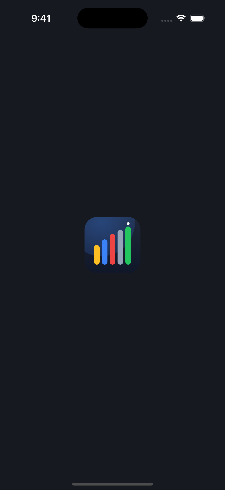
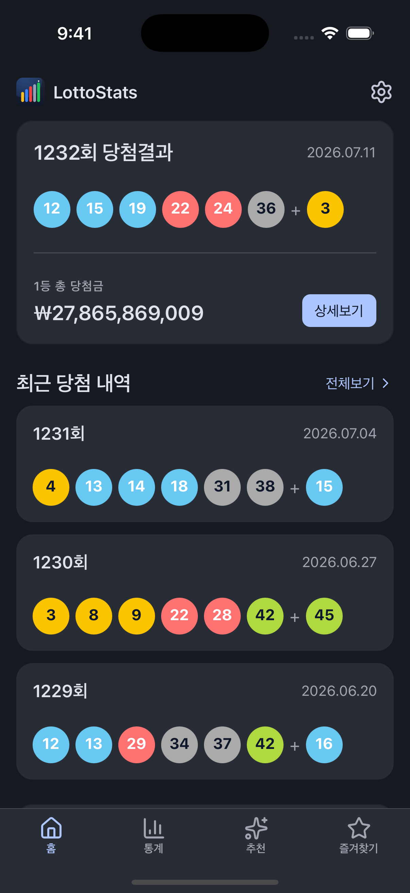
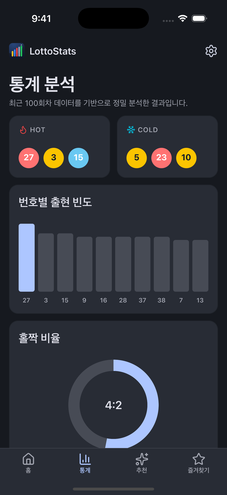
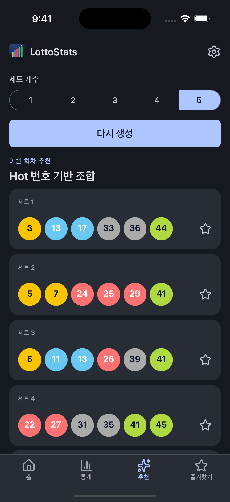
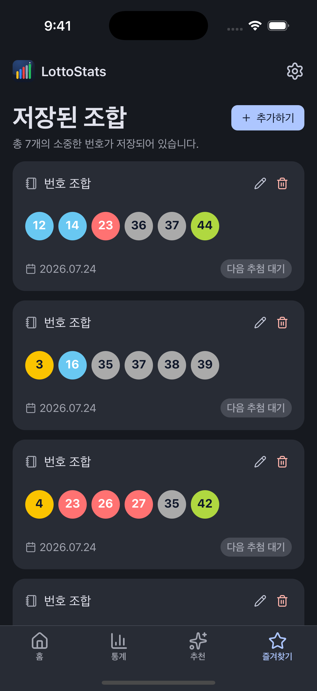
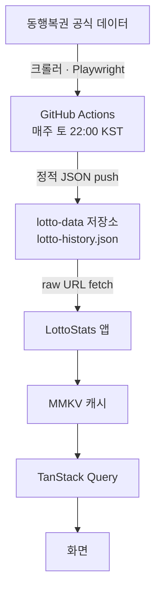

# LottoStats

한국 로또 6/45 당첨 데이터를 수집·분석해 통계와 번호 추천을 제공하는 React Native 앱입니다.


## 정체성

이 앱은 "당첨 예측 앱"이 아니라 **통계 분석 도구**입니다.

로또 6/45는 수학적으로 예측할 수 없습니다.

- 각 회차는 서로 독립된 사건입니다.
- 1등 당첨 확률은 1 / 8,145,060 입니다.

그래서 이 앱은 미래를 맞히려 하지 않습니다. 대신 지난 회차 데이터를 정직하게 집계하고 시각화해서, 번호가 실제로 어떻게 나왔는지 보여주는 데 집중합니다. 추천 기능도 "확률을 높인다"고 말하지 않습니다. 통계적 경향을 반영한 조합을 제안할 뿐입니다.

## 스크린샷

| 스플래시 | 홈 | 통계 | 추천 | 즐겨찾기 |
|---|---|---|---|---|
|  |  |  |  |  |

## 주요 기능

- **회차 탐색** — 최신 회차와 당첨번호, 회차 상세(등수별 당첨금·당첨자 수·총 판매액·1등 유형), 전 회차 목록. 목록은 검색·정렬을 지원하며 1,200회가 넘는 데이터를 가상화 리스트로 렌더링합니다.
- **통계 분석** — 출현 빈도, 홀짝 비율, 번호 합계 분포, 구간별 분포, 연속 번호, 끝수 분포, 동반 출현 히트맵까지 8가지 지표를 제공합니다. 분석 범위는 최근 30회 / 100회 / 전체로 전환할 수 있습니다.
- **번호 추천** — 5가지 알고리즘(Hot·Cold·Pattern·Balanced·Random)으로 조합을 생성하며, 한 번에 뽑는 세트 개수를 고를 수 있습니다.
- **즐겨찾기** — 마음에 드는 조합을 메모와 함께 저장합니다. 저장 이후 첫 추첨 회차의 실제 결과와 자동으로 비교해 등수 배지를 보여줍니다.

## 기술 스택

| 영역 | 사용 기술 | 용도 |
|---|---|---|
| 코어 | React Native 0.81 · React 19.1 · TypeScript 5.8 | New Architecture(Fabric)·Hermes 활성화 |
| 서버 상태 | TanStack Query 5 | 원격 데이터 fetch·재시도·상태 관리 |
| 로컬 상태 | Zustand 5 | 즐겨찾기·설정 등 도메인 상태 |
| 저장소 | react-native-mmkv 4 (NitroModules) | 동기 영구 캐시(회차·즐겨찾기·설정 인스턴스 분리) |
| 스타일 | styled-components 6 | 라이트/다크 테마(LottoTheme) |
| 애니메이션 | Reanimated 4 · react-native-worklets | 스플래시 막대 성장 애니메이션 |
| 시각화 | react-native-svg 15 | 차트·로고·아이콘 |
| 리스트 | @shopify/flash-list 2 | 전 회차 목록 가상화 |
| 네비게이션 | React Navigation 7 | Bottom Tab + Native Stack |
| 아이콘 | lucide-react-native | |
| 디자인 시스템 | @junkwon91/rn-design-system (v2.1.1) | 직접 만든 컴포넌트·테마 라이브러리 |

UI 컴포넌트와 테마, imperative 유틸(toast·dialog 등)은 이 앱에 직접 두지 않고 별도로 만든 디자인 시스템 라이브러리 `@junkwon91/rn-design-system`에서 가져옵니다. 앱은 그 컴포넌트를 재노출(re-export)하고, 로또 도메인 컴포넌트(당첨공·차트)만 자체적으로 보유합니다.

## 아키텍처 & 데이터 흐름

이 앱에는 백엔드 서버가 없습니다. 당첨 데이터는 정적 JSON 파일 하나로 관리되며, 그 파일을 만들고 갱신하는 일은 별도 크롤러 프로젝트가 GitHub Actions로 자동 처리합니다.



- 크롤러(별도 저장소)가 동행복권 데이터를 매주 자동 수집해 `JunKwon91/lotto-data` 저장소에 정적 JSON으로 push합니다.
- 앱은 그 JSON의 GitHub raw URL을 직접 fetch합니다. 새 회차가 나와도 데이터 저장소만 갱신되면 되므로, 앱을 다시 배포할 필요가 없습니다.
- **캐시 전략**: MMKV는 동기 방식으로 읽히므로, 앱을 켜면 캐시된 데이터를 첫 프레임부터 바로 화면에 그립니다(깜빡임 없음). 동시에 TanStack Query가 백그라운드로 최신 데이터를 동기화하고, fetch에 실패하면 기존 캐시를 그대로 반환해 오프라인에서도 화면이 끊기지 않습니다.

## 주요 기술 결정

이 프로젝트에서 내린 판단 몇 가지를 요약합니다. 각 결정의 상세한 배경은 아래 결정 기록 문서에 있습니다.

- **백엔드 없는 데이터 파이프라인** — 자체 API 서버는 비용·인증·유지보수 부담이 큽니다. 대신 당첨 데이터를 정적 JSON으로 두고 크롤러가 주간 자동 갱신하도록 했습니다. GitHub raw URL이 무인증·무료 호스팅 역할을 대신하며, 데이터 생산(크롤러)과 소비(앱)가 JSON 스키마로만 느슨하게 연결됩니다.

- **차트 라이브러리 제거(실측 기반)** — 초기 스택에 있던 Victory Native와 Skia는 실제 코드에서 한 번도 import되지 않으면서도 Skia 네이티브 바이너리(플랫폼당 수 MB)만 앱에 컴파일되고 있었습니다. 통계 화면 요구사항이 정적 차트(터치·줌 없음)라는 점을 확인하고 두 라이브러리를 제거한 뒤, 차트를 react-native-svg와 순수 View로 통일했습니다.

- **추천 알고리즘의 실측 설계** — 추천 로직은 모두 순수 함수로 두고 난수 생성기를 주입받게 만들어, 시드를 고정하면 결과가 재현됩니다. 설계 전에 1,000세트 시뮬레이션으로 파라미터를 확정했습니다. 예를 들어 Hot/Cold 가중치는 최다·최소 번호 선택 비율이 8.79배가 되도록 조정했고, Pattern·Balanced의 조건 충족률(각각 약 50%, 61%)을 측정해 재추출 비용이 낮은 값을 골랐습니다.

- **캐시·오프라인 전략** — MMKV 동기 읽기로 즉시 렌더링하고 TanStack Query로 백그라운드 동기화하는 구조를 유지합니다. 앱 전체에서 원격 쿼리가 사실상 하나뿐이라, 여러 쿼리를 일괄 저장·복원하는 표준 persister를 도입해도 이점이 없어 승격하지 않았습니다(불필요한 복잡도 회피). 오프라인 상황(캐시 유무·전환·새로고침 실패)은 모두 크래시나 무한 로딩 없이 처리되는 것을 확인했습니다.

- **디자인 시스템 분리(dogfooding)** — UI 컴포넌트와 테마, imperative 유틸을 앱에 직접 구현하는 대신 별도 npm 라이브러리로 분리했습니다. 라이브러리는 구조를, 앱은 색과 문구를 담당합니다. 앱은 이 컴포넌트를 재노출만 하고, 로또 전용 도메인 컴포넌트만 자체적으로 보유합니다.

상세 결정 기록: [DECISIONS.md](DECISIONS.md)

## 추천 알고리즘

5가지 알고리즘 모두 순수 함수이며, 결과 세트는 6개 번호를 오름차순·중복 없이 반환합니다.

| 알고리즘 | 방식 | 근거 |
|---|---|---|
| Hot | 자주 나온 번호에 가중치를 둔 비복원 추출 | 전체 회차 기준, floor 0.1 min-max 가중 — 최다/최소 선택 비율 8.79배 |
| Cold | 오래 안 나온 번호에 가중치를 둔 비복원 추출 | 마지막 출현 이후 간격(gap) 기준, Hot과 대칭 |
| Pattern | 연속 번호 1쌍 + 3개 이상 색 구간 충족 | rejection sampling — 실측 충족률 약 50% |
| Balanced | 홀짝 2~4개 + 번호 합계 105~175 충족 | rejection sampling — 실측 충족률 약 61%, 합계 평균 138의 ±1σ 근사 |
| Random | 완전 균등 무작위 | 비교군 |

Pattern·Balanced는 균등하게 뽑은 조합이 조건을 만족할 때까지 다시 뽑는 방식(최대 20회 시도)으로 구현했습니다. 충족률이 50%대라 평균 2회 미만의 시도로 조건을 만족합니다.

## 프로젝트 구조

```
src/
├── api/            httpClient, lottoApi          원격 fetch
├── config/         api.ts                        데이터 URL·타임아웃
├── types/          lotto, favorite, settings     공유 스키마
├── storage/        MMKV 인스턴스 3종             회차·즐겨찾기·설정 격리
├── services/       lottoHistoryLoader            fetch·캐시 오케스트레이션
├── hooks/queries/  useLottoData, lottoKeys       TanStack Query
├── lib/            queryClient
├── stores/         favoritesStore, settingsStore Zustand
├── theme/          colors, typography            LottoTheme(라이트/다크)
├── navigation/     RootNavigator, MainTabNavigator
├── utils/          statistics(8지표), algorithms(추천 5종), matchLotto, lottoRound
├── components/
│   ├── (primitives·surface·action·input·display·list·feedback)  디자인 시스템 re-export
│   ├── layout/     AppHeader, SubHeader, AppLogo
│   ├── lotto/      LottoBall, LottoBallSet, RoundCard, PrizeTable, RankBadge, NumberPicker
│   └── charts/     BarChart, DonutChart, SumTrendChart   (react-native-svg + View)
└── screens/        home / stats / recommend / favorites / settings / splash
```

컴포넌트는 세 층으로 나뉩니다. 디자인 시스템 라이브러리에서 가져오는 공통 컴포넌트, 로또 전용 도메인 컴포넌트(`lotto`·`charts`), 그리고 화면 상단 헤더 같은 레이아웃 컴포넌트입니다.

## 빌드 & 실행

**요구사항**

- Node.js 18 이상
- iOS: Xcode, 배포 타깃 iOS 16.0 이상
- Android: Android SDK

**설치 및 실행**

```bash
# 의존성 설치
npm install

# iOS는 CocoaPods 설치 필요 (최초 1회 및 네이티브 의존성 변경 시)
cd ios && pod install && cd ..

# Metro 번들러
npm start

# iOS 시뮬레이터
npm run ios

# Android (연결된 디바이스/에뮬레이터)
npm run android
```

**기타 스크립트**

```bash
npm test              # Jest
npm run lint          # ESLint
npm run licenses      # 오픈소스 라이선스 목록 생성
```

## 라이선스

개인 프로젝트로, 별도의 라이선스 파일은 두지 않았습니다. 앱이 사용하는 오픈소스 라이브러리의 라이선스 고지는 설정 화면의 "오픈소스 라이선스" 항목에서 확인할 수 있으며, `npm run licenses`로 갱신합니다.
